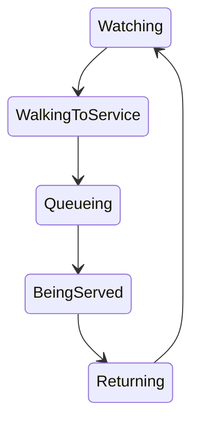

# Living Venue Gig Viewer — Implementation Plan

## Purpose

This plan expands both the player-facing Gig Viewer and the protected Admin Gig Viewer Demo into the same wide, deterministic **living venue** scene. The stage remains the visual focus while the venue interior, concessions, staff, fixed pedestrian routes, and the surrounding city or landscape make the show feel inhabited.

The work is presentation-first. It must not move gig scoring, settlement, inventory, or revenue calculation into the animation layer.

## Product invariants

These requirements apply in every phase:

- Keep the existing replay clock, controls, result navigation, highlights, playback speeds, audio lifecycle, and 20-second player song excerpts unchanged.
- Render the player viewer and demo through `GigViewerShell` and `GigCanvas`; the demo configures fixtures but must not grow a separate renderer.
- Use a stable 1280 × 720 authoring space and contain-fit the **entire** scene. Fullscreen, pop-out, desktop, tablet, and phone layouts may letterbox but must never crop the venue.
- Make **Venue Wide** the default camera. **Stage Focus** is user-selected and stable; **Auto** may direct event shots but must return to Venue Wide at song boundaries. Reduced Motion disables camera animation and uses snap transitions.
- Keep the stage at approximately 40–50% of the useful scene and visually readable at the smallest supported viewport.
- Derive cosmetic variation from namespaced gig-ID seeds. Rendering must not consume mutable random state, so seeking, resizing, speed changes, and different frame rates produce the same scene.
- Move counters only along authored paths and queue points. Do not add collision physics or per-attendee simulation.
- Treat displayed fans as representative counters, not attendee records. Pool them and cap their count by performance tier.
- Treat bar and merchandise animation as a projection of canonical facts. Animation can visualize calculated or saved results but cannot create sales.
- Preserve accessible text/timeline equivalents. Decorative venue activity must not flood assistive technology with announcements.

## Existing foundation and migration approach

The repository already contains useful pieces of this target rather than a blank-slate viewer:

- `SceneLayout` defines a fixed 16:9 logical scene, contain-fit geometry, wide camera, and normalized scene zones.
- `CameraDirector` already derives timestamp-based shots and returns wide at boundaries.
- `VenueSceneRegistry` resolves the seven required archetypes, generates three seeded variations, and defines bars, merchandise, entrances, queue points, and paths.
- `EnvironmentRegistry` resolves deterministic environment profiles and day/weather variants.
- `VenueActivity` and `AudienceActivity` provide an initial presentation-only activity layer.
- `RepresentativeCrowd` already caps the displayed crowd.
- `GigViewerReplay.commerce` can carry immutable bar and merchandise settlement facts.
- `GigViewerDemo` already supplies deterministic local fixtures and device presets through the production shell.

Implementation should therefore harden and extend these contracts instead of creating `LivingVenueViewerV2` alongside them. During delivery, incomplete features remain behind typed capability flags or absent replay data; the fallback is the current stage/crowd presentation.

## Shared target architecture

```text
GigExperienceDTO + GigViewerReplay + viewer preferences
                         |
                 Scene descriptor builder
       (venue + environment + seed + commerce evidence)
                         |
       +-----------------+------------------+
       |                 |                  |
  Static scene      Activity model      Camera policy
  architecture      fan/staff states    wide/focus/auto
  environment       timestamp-derived   reduced motion
       |                 |                  |
       +-----------------+------------------+
                         |
                    CanvasRenderer
                         |
       Player Gig Viewer and Admin Demo fixtures
```

### Contract boundaries

1. **Scene descriptor:** immutable, serializable output for a gig containing archetype, variation, anchors, paths, environment, decoration plan, service points, and performance tier.
2. **Activity projection:** a pure function of descriptor, replay facts, playback timestamp, song energy, speed, and accessibility preferences. It returns visual states; it does not own a second clock.
3. **Canonical commerce evidence:** saved merchandise lines, quantities, and bar totals. If evidence is missing, the renderer may show explicitly visual-only ambient service, but it must not imply exact sales.
4. **Renderer:** consumes resolved plans and snapshots. It may cache assets and pooled counters, but caches cannot alter deterministic output.
5. **Demo fixtures:** build the same descriptors and replay evidence as production. Demo-only controls select inputs/capabilities, never renderer forks.

## Delivery phases

### Phase 0 — Baseline audit and executable contracts

**Goal:** turn the existing partial foundation into a measured baseline before perceptible changes land.

**Work**

- Inventory the current scene, camera, activity, environment, replay commerce, preferences, renderer ordering, and demo controls; mark each target requirement as implemented, partial, or missing.
- Add pure contract tests for scene containment, camera bounds, all venue aliases, three variations per archetype, seed stability, path endpoints, and representative-crowd caps.
- Capture baseline frame-time, heap/counter count, and screenshots at 360 × 800, 390 × 844, 768 × 1024, 1366 × 768, and 1920 × 1080, including browser fullscreen and fixed-overlay fallback.
- Define performance tiers (`low`, `standard`, `high`) from device capability/preferences rather than viewport alone. Record counter, ambience, particle, and background-motion budgets for each tier.
- Add stable test hooks for selected camera mode, archetype, variation, environment, seed fingerprint, counter counts, and activity mode.

**Exit gate**

- Existing playback and result flows pass unchanged.
- The same fixture produces identical descriptor snapshots across rerenders, seek, resize, and playback speed.
- Baseline evidence is stored with the implementation notes so later phases can prove no regressions.

### Phase 1 — Wide scene foundation and camera modes

**Goal:** make the complete venue the default composition everywhere without changing playback semantics.

**Work**

- Make scene viewport sizing account for control-safe areas and mobile safe-area insets. Calculate available canvas space from the actual shell, not assumed window height.
- Enforce contain-fit at the canvas and camera layers. Separate the logical scene transform from the optional camera transform so Stage Focus and Auto cannot expose content outside safe camera bounds.
- Introduce the typed camera preference `venue_wide | stage_focus | auto`, defaulting to `venue_wide`, persisted beside existing viewer preferences.
- Add an accessible camera selector to full and compact controls. Preserve keyboard order and ensure fullscreen controls remain outside the scene's authored bounds.
- Define Stage Focus from the layout's stage/crowd union rather than fixed pixels. Auto continues to use timestamp-derived event direction and resets wide at song boundaries.
- Reserve foreground-effect and label-safe rectangles so pyrotechnics, captions, and controls cannot obscure key stage performers.
- Add demo camera and viewport controls that exercise the production preference and shell.

**Exit gate**

- The entire venue is visible at all baseline sizes and in pop-out/fullscreen; letterboxing is acceptable, cropping is not.
- The stage occupies 40–50% of useful scene area in each archetype's wide composition.
- Play, pause, restart, seek, speed, previous/next song, next highlight, result, audio, Reduced Motion, and Pyrotechnics behave as before.
- Camera mode survives fullscreen transitions and resets predictably when a different gig opens.

### Phase 2 — Venue layout system and architecture

**Goal:** provide a recognizable, reusable cutaway for every venue class with deterministic variety.

**Work**

- Promote the existing venue layout into a versioned `VenueSceneDescriptor`; namespace new seeds (for example `layout-v2`, `decor-v2`) so future additions do not silently reshuffle old replays.
- Validate every descriptor: normalized bounds, non-overlapping control safe area, reachable service paths, queues inside the scene, stage readability, and at least one return point per crowd zone.
- Refine all three variations for each archetype rather than only swapping sides:

| Archetype | Required visual language |
| --- | --- |
| Pub | Open-front room, side bar, tables, toilets, posters, windows, one small merchandise table |
| Club | Long bar, dancefloor, booths, lighting rig, security, one or two merchandise points |
| Theatre | Proscenium, balconies/seating, foyer bar, formal details, separated aisles |
| Arena | Wide bowl, tiered seating, concourse bars, several kiosks, tunnels and screens |
| Stadium | Large stands, tunnels, food/concourse areas, screens, exterior transport/city edge |
| Festival | Open field, tents, fencing, generators, food trucks, service lanes and distant horizon |
| Beach | Sand, sea, promenade, pier/boats, beach bar and sunset-capable horizon |

- Model service points as arrays. Scale bar/merch/staff counts by archetype and capacity band; large venues gain distributed services rather than one oversized queue.
- Author explicit path graphs connecting crowd zones, entrances, bars, merchandise, and exits. Store route IDs and waypoints; counters interpolate along them with no collision solver.
- Split painter layers into exterior, architecture, rear decoration, stage/band, crowd floor, concessions/activity, foreground effects, and UI. Document which layers camera modes may emphasize.
- Keep old or unknown venue data safe through archetype and environment fallbacks.

**Exit gate**

- Seven archetypes × three materially distinct layouts render in the demo.
- Reopening a gig resolves the same layout and decoration fingerprint; different gig IDs demonstrate controlled variation.
- Every bar and merchandise anchor is reachable from every assigned crowd zone and has valid queue/staff points.
- Small venues read as dollhouses; arenas/stadiums read as bowls with concourses; the stage remains dominant in both.

### Phase 3 — Deterministic bar and merchandise activity

**Goal:** show fans leaving the audience, receiving service, and returning without making animation authoritative.

**Visual state machines**



Staff use a smaller `Idle → WalkingToStation → Serving → Handover → Idle` loop. Each transition is derived from replay time and a counter-specific seed; no `setTimeout` or frame-count progression is authoritative.

**Work**

- Pool fan and staff counters. Assign stable visual IDs, home crowd slots, service choice, path, queue slot, service duration, purchase visual, and return slot from namespaced seeds.
- Compute demand windows from canonical phase/song timing:
  - high before show and between songs;
  - higher during comparatively weak songs;
  - lower during popular songs, major highlights, encore, and finale;
  - never so high that the readable stage crowd disappears.
- Return served fans to a seeded crowd position different from their origin while preserving the representative crowd total.
- Animate bartenders between tills, taps, and queue heads; show a small drink/handover icon. Scale service points and staff with venue size.
- Render merchandise product silhouettes from available product data, with safe generic shirt/poster/bag fallbacks. Reflect merchandise setup in staff count, stand size, and throughput presentation.
- Distinguish activity modes:
  - `ambient`: visual-only behavior where canonical event detail is unavailable;
  - `aggregate`: allocate exact saved totals plausibly across the timeline without claiming customer-level truth;
  - `event_replay`: replay saved timestamped transaction events exactly when a future schema supplies them.
- At 2× and Fast speeds, derive the same transactions/states at a later timestamp. Never loop faster and thereby create more handovers or sales.
- Under Reduced Motion, replace walking with limited crossfades/snap states while retaining understandable queue/service changes.
- Add demo controls for no commerce, ambient activity, low/high aggregate commerce, stock-limited merchandise, multi-stand stadium, and saved-event fixtures.

**Exit gate**

- At least one fan can complete a bar trip and one a merchandise trip and return during deterministic demo fixtures.
- Staff visibly serve the queue; purchase visuals are readable but do not obscure the show.
- Seeking backward and forward reconstructs the correct state immediately.
- Normal, 2×, and Fast end with identical canonical merchandise/bar totals and activity fingerprints.
- Empty, zero-stock, missing-product, and legacy-commerce cases render safely without fabricated financial claims.

### Phase 4 — City and environment packs (implemented v1.1.668)

**Goal:** show a valid location-aware exterior behind or around the venue cutaway.

**Work**

- Formalize profiles for dense city centre, industrial/red-brick, riverside/docklands, coastal/beach, tropical, desert, alpine, countryside, park, and historic city. Preserve a generic fallback.
- Resolve profile in this priority order: explicit venue environment → event/venue subtype → city mapping → climate/coastal metadata → region/country → compatible fallback.
- Add layered, stylized pack primitives: skyline/roofline, local architecture, road furniture, rail/traffic/boats/aircraft, vegetation, mountains/coast/rivers, and restrained local posters/flags/colors.
- Filter every randomized detail through profile and venue compatibility. For example, boats require water, alpine trees must not appear in a desert pack, and indoor city clubs must not select festival field props.
- Derive scheduled local day/sunset/night and weather variant without live network calls. Weather is presentation metadata or deterministic fallback, never replay-time API data.
- Use landmark-inspired silhouettes only; avoid copying protected logos or detailed real-world landmark artwork.
- Give background motion its own budget and disable or simplify traffic, water, and weather motion under Reduced Motion or the low tier.
- Add demo selectors for city/profile, time, weather, and fallback-data scenarios while clearly labeling overrides as fixture-only.

**Exit gate**

- All ten profiles have deterministic fixtures and compatibility tests.
- Manchester-style industrial, coastal promenade/sea, park/festival, countryside, desert, alpine, and historic examples are visibly distinguishable.
- Same gig/location/time data yields the same environment; invalid explicit combinations fall back safely.
- Background contrast never makes performers, queues, or controls unreadable.

### Phase 5 — Canonical gameplay integration (inspector + evidence modes implemented v1.1.669)

**Goal:** replace aggregate visual approximations with saved gameplay evidence where that evidence exists.

**Work**

- Extend the read model, not the renderer, to expose merchandise catalog snapshots, stock/setup/staffing, settlement line items, and saved commerce events.
- Version replay payload changes and validators. Old replay versions remain viewable with ambient/aggregate fallback; do not mutate historical payload meaning in place.
- Snapshot product display facts needed for replay (name, item type, safe asset reference, variant) so later catalog edits do not rewrite history.
- Allocate aggregate saved sales deterministically when customer-level event timestamps do not exist. Mark this as presentation inference in diagnostics.
- If transaction events are introduced, create them in the authoritative gig/settlement workflow with idempotency and ordering guarantees, then consume them read-only in the viewer.
- Keep bar ownership and revenue shares in venue/booking settlement services. The viewer may display authoritative venue totals but cannot calculate or post them.
- Add authorization and payload-size limits for product assets and commerce details; never expose private cost/ownership data beyond the player's existing permissions.
- Expand the replay inspector to show schema/version, evidence mode, aggregate totals, event counts, seed fingerprint, and validation failures without exposing signed asset URLs.

**Exit gate**

- Product visuals and quantities agree with immutable replay/settlement evidence.
- Replay regeneration/recovery is idempotent and produces stable checksums for identical inputs.
- No viewer or demo interaction performs a gig, inventory, settlement, or finance mutation.
- Legacy and partially populated gigs retain a usable stage-first replay.

### Phase 6 — Atmosphere, performance, accessibility, and release (ambience buses implemented v1.1.670; performance tiers, static layer caching, DPR caps and degradation order implemented v1.1.671; quality preference control and hidden-tab render pause implemented v1.1.672; keyboard accessibility and no-mutation gates implemented v1.1.673)

**Goal:** polish the living venue while certifying smooth large-scene playback.

**Work**

- Add opt-in low-volume ambience buses for venue bed, bar chatter, tills/glasses, outdoor traffic/water/weather, beneath music and crowd audio. Reuse the existing user activation, mute, volume, hidden-tab, speed, and cleanup policy.
- Pool every repeated drawable and precompute static plans. Cache static background/architecture layers by descriptor fingerprint and redraw dynamic layers only when needed.
- Enforce tier budgets. Stadiums aggregate stands and use at most the representative-counter cap; concession count may rise without rendering attendee-scale queues.
- Pause rendering/audio when hidden; avoid allocation in frame loops; cap device-pixel ratio where necessary; document graceful degradation order (ambient particles → background movers → crowd detail → service detail).
- Respect Reduced Motion across camera, paths, weather, water, crowd, signage, and effects. Preserve the existing Pyrotechnics setting independently.
- Maintain timeline/labels for all meaningful canonical highlights. Camera controls and diagnostics must be keyboard accessible, named, and contrast compliant.
- Run unit, component, Playwright, accessibility, visual-regression, performance, and mutation-interception gates against both player and demo entry points.
- Roll out behind a viewer capability flag: admin demo → internal player replay → percentage rollout → default. Keep a one-release fallback to the prior renderer path, then remove it after telemetry and support review.

**Exit gate**

- Frame-time and memory budgets pass on agreed low/mid/high reference devices, including a sold-out stadium fixture.
- Audio nodes and animation loops are fully cleaned up on close, navigation, hidden tab, and replay change.
- Automated checks cover Reduced Motion, Pyrotechnics off, keyboard-only use, fullscreen, mobile containment, and no-mutation behavior.
- Product completion criteria below are signed off with screenshots and performance traces.

## Recommended pull-request slices

Keep PRs independently releasable and avoid combining renderer rewrites with schema/database changes.

1. Baseline matrix, deterministic descriptor tests, and performance instrumentation.
2. Shell containment/control safe areas and camera preference contract.
3. Venue descriptor validation and three variations for pub/club/theatre.
4. Arena/stadium/festival/beach variations, service arrays, and path graphs.
5. Static architecture and concession rendering.
6. Pure activity state projection, pooling, and bar service.
7. Merchandise display/activity and commerce evidence modes.
8. Environment profile resolver and static packs.
9. Time/weather/background motion and accessibility degradation.
10. Versioned canonical commerce/product integration and inspector changes.
11. Ambience buses, performance tiers, visual regression, and staged rollout.

Each PR must update production and demo fixtures together and include a before/after statement for deterministic output, replay compatibility, accessibility, and performance.

## Verification matrix

| Area | Required verification |
| --- | --- |
| Determinism | Descriptor/snapshot equality for same gig; expected inequality across seeds; stable after resize, seek, reload, and speed changes |
| Layout | 7 archetypes × 3 variations; path/queue validation; stage ratio; safe bounds |
| Responsive | 360 × 800, 390 × 844, tablet, common laptop/desktop, ultrawide, fullscreen, pop-out |
| Playback | Play/pause/restart/seek, previous/next song, highlight, result, normal/2×/Fast, 20-second player excerpts |
| Activity | Every state transition, alternate return slot, staff handover, multiple service points, zero-stock/no-commerce/legacy cases |
| Environments | 10 profiles, compatible and invalid combinations, day/sunset/night, weather, missing location fallback |
| Accessibility | Keyboard, focus visibility, names, contrast, timeline equivalence, Reduced Motion, Pyrotechnics off, axe |
| Performance | Low/mid/high tiers, stadium aggregation, counter caps, DPR cap, hidden-tab pause, teardown/leak checks |
| Authority | Network mutation interception; saved totals unchanged by speed/seek; replay schema validation; authorization |

## Definition of done

The expansion is complete only when all of the following are demonstrated in both the real Gig Viewer and Admin Gig Viewer Demo:

- The whole venue is visible at common phone and desktop sizes, fullscreen, and pop-out.
- Every venue archetype has at least three recognizable deterministic variations.
- Fans visibly complete bar and merchandise journeys and return to different stage-viewing positions.
- Staff visibly queue and serve customers.
- City, coastal, and outdoor backgrounds resolve from compatible gig location data.
- Replaying the same gig preserves layout, decoration, routes, counters, product display, and environment.
- Different gig IDs vary within valid archetype/environment packs.
- Stadium fixtures remain within counter, frame-time, and memory budgets while representing large attendance through aggregation.
- Stage action remains readable and visually dominant in Venue Wide, Stage Focus, and Auto.
- Playback controls, 20-second player song excerpts, audio behavior, highlights, results, Reduced Motion, and Pyrotechnics have no regressions.
- Animation never creates a sale, changes stock, settles revenue, or mutates gig state.

## Explicitly deferred

- Per-attendee simulation or collision physics.
- Live weather API calls during replay.
- Animation-driven financial calculations.
- Unique hand-authored geometry for every city.
- Customer-level commerce claims when only aggregate settlement facts exist.
- Rendering every attendee in arena or stadium crowds.

## Closure log (v1.1.674)

All previously outstanding items are implemented and covered by automated gates:

- Capability flag and staged rollout with a legacy renderer fallback — `viewer/config/viewerCapabilityFlags.ts`, wired through `GigViewerShell` and `GigCanvas` (`data-living-venue`, `data-viewer-rollout-*`).
- Animated signage layer (marquee, service signs, screens, neon) — `engine/VenueSignagePlan.ts`, budget-gated and reduced-motion safe.
- Visual-regression gate via draw-call fingerprints per archetype — `tests/visualRegression.test.ts`.
- Replay regeneration idempotency proof — `engine/ReplayChecksum.ts` plus `tests/replayChecksum.test.ts`, surfaced in the evidence inspector and admin audit.
- `event_replay` commerce evidence mode — `GigReplayCommerceEvent` schema, authoritative timings in `engine/VenueActivity.ts`.
- Baseline performance and rollout artifacts — `docs/gigs/artifacts/viewer-performance-baseline.md`.
