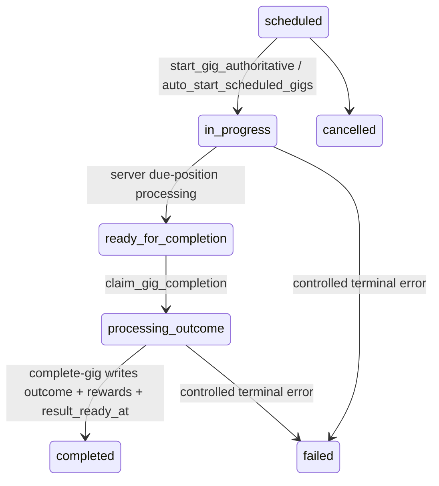

# Phase 5 PR 04 — Server-Authoritative Gig Timeline and Completion Hardening

## Previous progression model

Gig progression had several authorities. Manual start updated `gigs.status`, `started_at`, and `current_song_position` directly from the client. The live viewer hook polled browser time, invoked `process-gig-song`, called `advance_gig_song`, and invoked `complete-gig`. `auto-start-gigs` called `auto_start_scheduled_gigs`; `auto-complete-gigs` only completed gigs whose total duration had elapsed; `complete-gig` backfilled missing song rows; `fix-stuck-gigs` was a recovery path. The main race risks were duplicate tab processing, client-owned status updates, duplicate song-performance inserts, and concurrent completion/reward application.

## Canonical state machine

- `scheduled`: entered by booking; start allowed only when due and setlist/band/venue are valid.
- `in_progress`: entered by guarded server start; song processing allowed; viewer may display; result not available.
- `ready_for_completion`: entered when all canonical positions are processed; completion allowed; viewer may display wrapped state.
- `processing_outcome`: entered by the completion claim lock; outcome processing allowed; viewer shows processing.
- `completed`: entered after outcome/rewards/notifications succeed; `completed_at` and `result_ready_at` are set; result is available.
- `cancelled`: terminal; no song or outcome processing.
- `failed`: terminal/support state for controlled failures.

## Server ownership model

The client is no longer an advancement authority. Manual start calls `start_gig_authoritative`. Normal song advancement is done by `auto-complete-gigs`, which catches up due positions from `started_at`, song durations, and stored progress. Completion is claimed by `claim_gig_completion` and finalized by `complete-gig`.

## Start flow

`start_gig_authoritative(gig_id)` locks the gig row, rejects early/invalid starts, requires scheduled status, validates setlist rows, band, and venue, writes `started_at` once, initializes `current_song_position`, and returns the existing state on safe retries.

## Song-processing flow

`gig_song_performances` now has a unique `(gig_outcome_id, position)` constraint. `process-gig-song` rejects cancelled/completed/failed gigs, returns an existing row for duplicate calls, handles concurrent unique violations by refetching, and marks the processed position through a service-only RPC.

## Advancement flow

`auto-complete-gigs` now processes every due unprocessed setlist position on each worker pass. Late workers catch up by processing all positions whose elapsed authoritative duration has passed.

## Completion flow

`complete-gig` uses `claim_gig_completion` to serialize completion. Duplicate calls return the existing completed/processing state. Missing songs are still backfilled through the same idempotent song processor. The existing reward and outcome formulas are preserved.

## Result-ready rule

The report is available when `gigs.result_ready_at` is present. The fixed ten-minute UI delay is removed. Skipping or refreshing only changes what the player sees; it does not complete the gig or alter rewards.

## Multiple-tab handling

Tabs may request start, song processing, completion, or refresh concurrently, but database locks/unique constraints/RPC claims own the mutation. Realtime subscriptions/refetching converge each tab on the canonical state.

## Viewer read-only conversion

`useLiveGigState` subscribes to gig and song-performance changes and refetches. `useRealtimeGigAdvancement` remains as a compatibility alias, but no longer invokes song processing, advancement, completion, or reward changes.

## Database changes, RLS, and grants

Added `result_ready_at`, progression error fields, a unique song-position constraint, timeline indexes, guarded start/position/completion RPCs, fixed `search_path`, revoked anon/public mutation execution, and limited internal helpers to `service_role`.

## Error model and observability

Controlled errors are raised for missing gigs, early starts, missing/empty setlists, missing band/venue, terminal statuses, and duplicate processing/completion. Server logs include gig id, status, position, duplicate-prevention, start, catch-up, and completion events.

## Tests

Added migration-level idempotency protections and frontend hook conversion. Validation for true database concurrency still requires a running Supabase test database.

## Known limitations

- Existing outcome/reward formulas remain non-deterministic where they already used randomness.
- True concurrent RPC tests were not executed in this environment.
- `auto_start_scheduled_gigs` remains the scheduled start entry point; manual start is now guarded by the new RPC.

## Recommended Phase 5 PR 05

Build the canonical viewer/replay event payload on top of this server-owned lifecycle, including deterministic event generation and Canvas/non-Canvas synchronized rendering.
