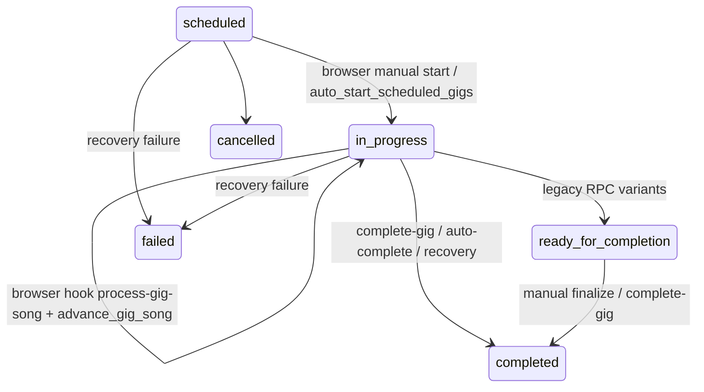

# Phase 5 PR 04 — Server-Authoritative Gig Timeline and Completion Hardening

## Previous progression model

Manual starts updated `gigs.status`, `started_at`, and `current_song_position` directly from `useManualGigStart`. The live-view hook `useRealtimeGigAdvancement` polled browser time, called `process-gig-song`, then called `advance_gig_song`; completion could be called by the viewer, the manual finalize CTA, `auto-complete-gigs`, and `fix-stuck-gigs`. `complete-gig` backfilled missing songs, but song rows and outcomes did not have canonical unique protection. Result display used a fixed ten-minute UI delay after `completed_at`.

## Canonical state machine

| Status | Owner | Previous state | Required timestamps | Next states | Song processing | Outcome processing | Viewer | Result | Recovery |
| --- | --- | --- | --- | --- | --- | --- | --- | --- | --- |
| `scheduled` | booking systems | none | `scheduled_date` | `ready`, `in_progress`, `cancelled`, `failed` | no | no | preparation | no | start when due |
| `ready` | server/admin | `scheduled` | `scheduled_date` | `in_progress`, `cancelled`, `failed` | no | no | preparation | no | start when due |
| `in_progress` | `start_gig_authoritative` / worker | `scheduled`, `ready` | `started_at` | `ready_for_completion`, `processing_outcome`, `completed`, `failed` | yes | no | live read-only | no | catch-up worker |
| `ready_for_completion` | worker/RPC | `in_progress` | `started_at` | `processing_outcome`, `completed`, `failed` | yes for backfill | yes | live/read-only | no | complete-gig |
| `processing_outcome` | `complete-gig` | `in_progress`, `ready_for_completion` | `started_at` | `completed`, `failed` | backfill only | yes | processing | no | retry complete-gig |
| `completed` | `mark_gig_result_ready` | `processing_outcome` or idempotent retry | `started_at`, `completed_at`, `result_ready_at` | none | no | no | report CTA | yes | no-op retry |
| `cancelled` | booking/admin | scheduled states | optional | none | no | no | controlled message | no | support only |
| `failed` | worker/recovery | any non-terminal | optional | support controlled retry | no except support | no except support | error | no | support recovery |

## Server ownership model

`start_gig_authoritative` is the guarded start operation. `auto_start_scheduled_gigs` now delegates to it. `auto-complete-gigs` is the server catch-up worker: it derives due setlist positions from `started_at`, authoritative song durations, existing performance rows, and server time. The viewer hook is read-only and only subscribes/refetches.

## Start flow

The start RPC locks the gig row, requires `scheduled`/`ready`, denies early starts, verifies setlist/band/venue dependencies, initializes `started_at` and `current_song_position` once, creates a single pending outcome, and returns the existing started state on retry.

## Song-processing flow

`gig_song_performances` is unique by `(gig_outcome_id, position)`. `process-gig-song` checks terminal gig states before scoring, returns an existing row on duplicates, and handles unique-conflict retries by re-reading the canonical row.

## Advancement flow

Browser-owned advancement is disabled. The legacy `advance_gig_song` RPC now raises unless invoked by the service role; normal progression is performed by the scheduled `auto-complete-gigs` worker. Late worker runs process every due missing position and update `current_song_position` from server-derived progress.

## Completion flow

`complete-gig` marks `processing_outcome`, backfills missing setlist positions through `process-gig-song`, preserves existing scoring/reward formulas, and finishes through `mark_gig_result_ready`, which sets `completed_at` and `result_ready_at` once. Safe retries return the existing result.

## Result-ready rule

The UI uses `gigs.result_ready_at`. Reports are available immediately when that timestamp exists. The fixed ten-minute delay was removed. Skipping the viewer only closes the viewer path; it never completes a gig or changes rewards.

## Multiple-tab handling

Multiple tabs may subscribe/refetch, but they no longer call song advancement or completion as part of viewing. Duplicate starts, song processing, and completion converge through row locks, uniqueness, and idempotent server checks.

## Database changes

Added `gigs.result_ready_at`, `gigs.progression_error`, `gig_song_performances.processing_attempted_at`, unique indexes for one outcome per gig and one performance per outcome position, and hardened RPCs for start/result-ready/disabled client advancement.

## RLS and grants

The new start RPC is executable by authenticated users and service role; direct anonymous execution is revoked. Result-ready and legacy advancement mutation are service-role only. Existing table RLS remains the read boundary for outcomes and performance rows.

## Error model

Start errors are terminal for missing dependencies and retryable for transient worker failures. Song processing rejects cancelled/completed/failed gigs. Completion retries are safe after partial worker failure because rows/outcomes are unique.

## Observability

Existing Edge Function logs now include start, catch-up, duplicate prevention, song processing, completion, and failure events with gig IDs and positions.

## Tests

Automated test coverage is currently limited by the repository's Supabase test harness availability. The migration encodes sequential idempotency protections for duplicate start/song/completion paths; true concurrent database tests are recommended for the next PR.

## Known limitations

- Existing reward application in `complete-gig` remains a large non-transactional Edge Function and should be moved into a single database transaction in PR 05.
- `fix-stuck-gigs` still contains legacy recovery calculations and should be narrowed to delegate to the canonical RPCs only.
- Realtime performance subscriptions still listen broadly and refetch on changes rather than filtering by outcome-derived gig ID.

## Recommended Phase 5 PR 05

Move completion/reward side effects into a transactional database routine, add pgTAP/concurrency coverage for advisory/row locks, and replace legacy recovery with a support-only canonical retry tool.
