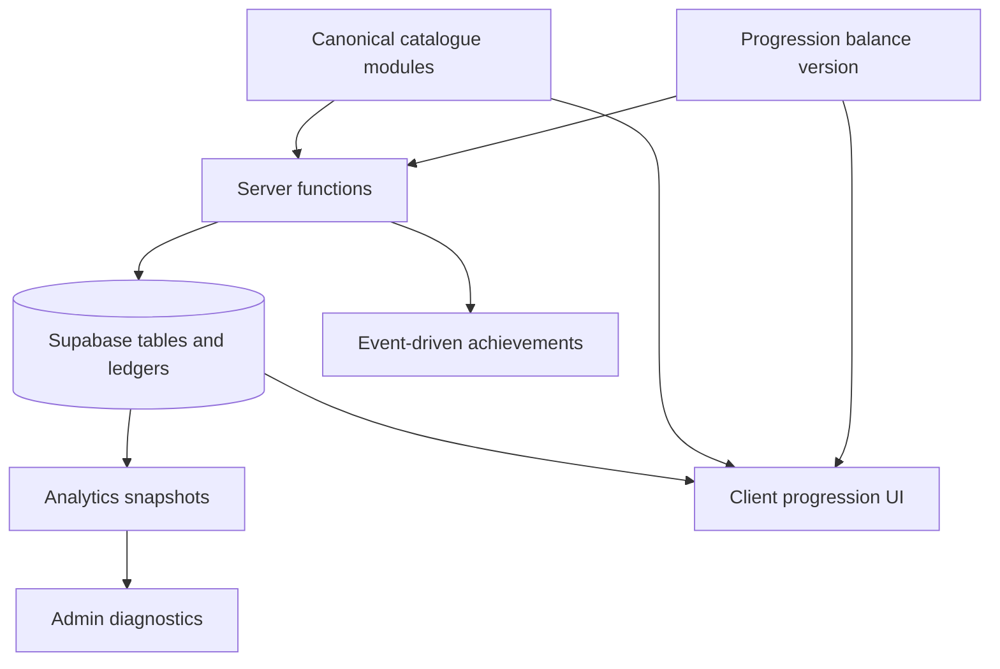
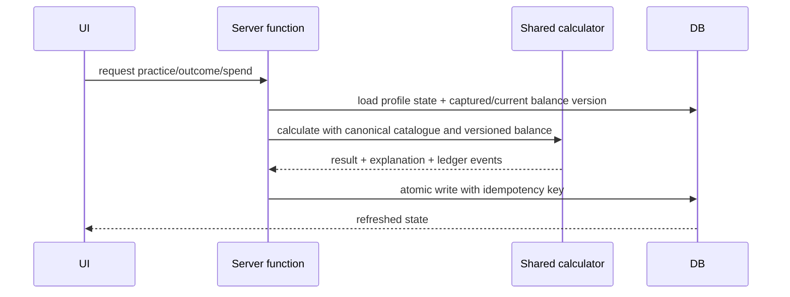

# Skills and Attributes Architecture

The final architecture separates immutable design data, player-owned state and observable events. The database stores player progress, ledgers, captured versions and RLS boundaries. Shared typed modules own catalogue metadata and formulas. Server functions own rewards, spends and outcome writes. Client UI formats canonical values and must not redefine rules.

## Data ownership

| Layer | Owns | Must not own |
|---|---|---|
| Database | profile-scoped state, ledgers, captured balance version, RLS, immutable outcome records | client-derived quality or rewards |
| Server functions | reward/spend authority, idempotency, calculator execution, repair audit logs | silent slug inference for new data |
| Shared typed modules | catalogue, relationships, formulas, policies, validation helpers | profile-specific mutable balances |
| Client UI | formatting, loading states, accessible explanations, cache invalidation | XP/AP/quality/reward calculations |

## Runtime flow

## Long-running activities

Songwriting projects, recording bookings, scheduled gigs, teaching sessions, mentoring goals, band training plans and mastery challenges capture a balance/catalogue version at creation. Completion uses the captured version. Unknown versions fail safely for new writes; legacy reads render immutable incomplete details.

## Source-of-truth rule matrix

| Rule | Authoritative source | Consumers | CI guard |
|---|---|---|---|
| XP required per level | `src/utils/progressionBalance.ts` (`PROGRESSION_BALANCE.curves`, `getXpRequiredForLevel`) | practice, dashboards, simulations | `npm run validate:progression-programme` |
| Cumulative XP and level from lifetime XP | `src/utils/progressionBalance.ts` helpers | UI progress, ledgers, analytics | validation command plus unit tests |
| Maximum skill level | `CANONICAL_SKILLS.max_level` | unlocks, spend validation, UI | catalogue validation |
| Practice daily limit and reward | `PROGRESSION_BALANCE.practice` | server progression functions and UI previews | validation command |
| Attribute upgrade cost and cap | `getAttributeUpgradeCost`, `PROGRESSION_BALANCE.attribute` | AP spend, Attribute UI | validation command |
| Learning bonus cap | `PROGRESSION_BALANCE.learning` and `calculateWeightedLearningMultiplier` | practice, lessons, education | validation command |
| Songwriting weights | canonical system links plus songwriting calculator | previews and completion | cross-system tests |
| Recording weights | canonical role/system links plus recording calculators | previews and completion | cross-system tests |
| Gig weights | canonical role/system links plus gig calculators | readiness and gig completion | cross-system tests |
| Mastery rank requirements | catalogue mastery metadata and mastery migrations | mastery UI and services | catalogue validation |
| Maintenance grace period | `src/utils/skillMaintenance.ts` policy metadata copied onto catalogue | sharpness UI and services | validation command |
| Teaching repetition penalty | teaching outcome calculator/balance config | lessons and mentoring | teaching tests |
| Achievement rewards | achievements validator/config and server events | achievement completion | achievement tests |
| Role-readiness threshold | canonical role links | band/gig/recording readiness | cross-system tests |
