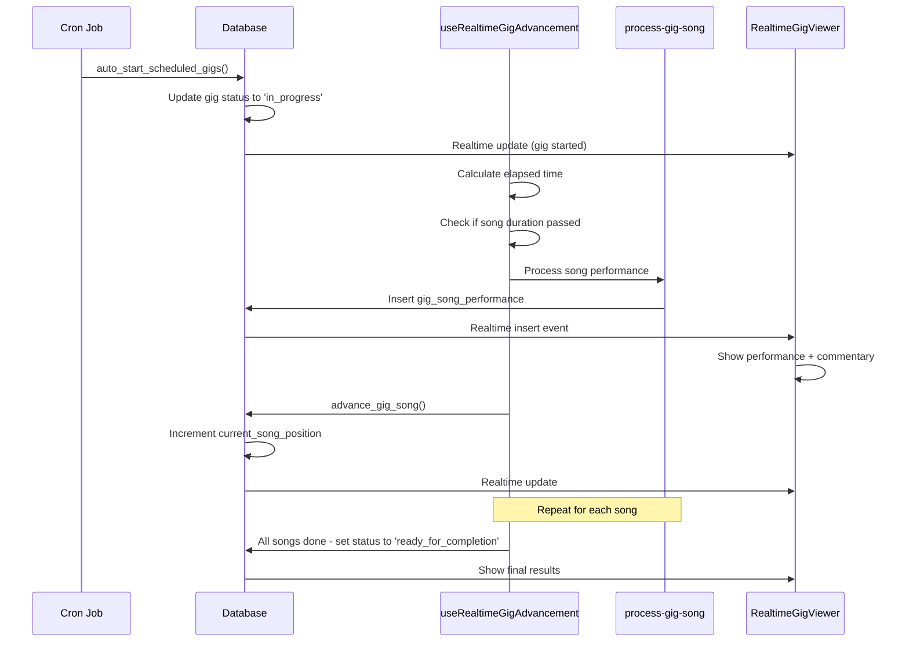

# Real-Time Gig Performance System

## Overview
Redesigned the gig performance system to be fully automated and real-time, removing manual "Perform Now" buttons in favor of scheduled, time-based performances with live feedback.

## Key Changes

### 1. Database Schema Enhancements

**New columns in `gigs` table:**
- `started_at` - Timestamp when gig actually started
- `completed_at` - Timestamp when gig finished
- `current_song_position` - Track which song is currently playing (0-indexed)
- `setlist_duration_minutes` - Calculated total duration of all songs

**New columns in `gig_song_performances` table:**
- `started_at` - When this specific song started
- `completed_at` - When this song finished

**Database Functions:**
- `calculate_setlist_duration(setlist_id)` - Sums up duration of all songs in setlist
- `auto_start_scheduled_gigs()` - Automatically starts gigs that have passed their scheduled time
- `advance_gig_song(gig_id)` - Advances to next song in the setlist

### 2. Edge Functions

**`auto-start-gigs`** (Cron: every 5 minutes)
- Checks for scheduled gigs that should have started
- Automatically starts them and sets status to 'in_progress'
- Calculates setlist duration

**`process-gig-song`**
- Processes performance for a single song
- Calculates score based on:
  - Song quality (25%)
  - Rehearsal level (20%)
  - Band chemistry (15%)
  - Equipment quality (15%)
  - Crew skill (10%)
  - Member skills (15%)
- Determines crowd response (ecstatic, enthusiastic, engaged, mixed, disappointed)
- Creates performance record in real-time

### 3. Frontend Components

**`RealtimeGigViewer.tsx`**
- Displays live gig performance as it happens
- Shows:
  - Live status badge (🔴 LIVE)
  - Progress bar (songs completed / total songs)
  - Current song playing
  - Elapsed time / remaining time
  - Average performance score
  - Real-time commentary based on crowd response
  - Performance history with all completed songs

**Real-time Updates via Supabase:**
- Subscribes to `gigs` table changes
- Subscribes to `gig_song_performances` inserts
- Automatically updates UI as songs complete
- Generates dynamic commentary for each performance

**`useRealtimeGigAdvancement.ts` Hook:**
- Drives song-by-song progression
- Calculates when to advance based on song durations
- Calls `process-gig-song` edge function for each song
- Calls `advance_gig_song` RPC to increment position
- Handles timing automatically - no manual triggers needed

### 4. Performance Flow



## User Experience

### Before
1. User navigates to gig
2. Clicks "Perform Now" button
3. Manually clicks "Perform Song" for each song
4. Waits for simulated performance (2 seconds per song)
5. Reviews outcome

### After  
1. Gig automatically starts at scheduled time
2. User can watch live performance unfold in real-time
3. Each song plays for its actual duration (e.g., 3 min song = 3 min real time)
4. Real-time commentary appears:
   - "The crowd is going absolutely wild! 🔥"
   - "Amazing energy from the band right now!"
   - "The energy has dipped a bit on this one"
5. Performance history builds up automatically
6. Average score updates live
7. Countdown shows time remaining
8. No manual intervention needed

## Real-Time Features

### Live Status Indicators
- 🔴 LIVE badge during performance
- Pulsing music icon
- Animated progress bar
- Real-time clock showing elapsed/remaining time

### Dynamic Commentary
Generated based on crowd response:
- **Ecstatic (22-25)**: "The crowd is going absolutely wild! 🔥"
- **Enthusiastic (19-22)**: "Amazing energy from the band right now!"
- **Engaged (15-19)**: "Nice work! The crowd is engaged 👍"
- **Mixed (10-15)**: "Mixed reactions from the crowd... 😐"
- **Disappointed (<10)**: "Tough one... the crowd seems disappointed 😞"

Commentary appears for 5 seconds after each song, then clears.

### Performance Metrics
- Average score across all songs
- Individual song scores with crowd response badges
- Visual indicators (stars, progress bars)
- Color-coded responses

## Technical Implementation

### Realtime Subscriptions
```typescript
supabase
  .channel('gig-updates')
  .on('postgres_changes', {
    event: 'UPDATE',
    schema: 'public',
    table: 'gigs',
    filter: `id=eq.${gigId}`
  }, (payload) => {
    // Handle gig status changes
  })
  .subscribe();

supabase
  .channel('song-performances')
  .on('postgres_changes', {
    event: 'INSERT',
    schema: 'public',
    table: 'gig_song_performances'
  }, (payload) => {
    // Handle new song completion
    // Generate commentary
  })
  .subscribe();
```

### Song Timing
Each song advances based on its actual duration:
```typescript
const songDuration = song.duration_seconds || 180; // Default 3 min
const elapsedSeconds = differenceInSeconds(new Date(), startTime);

if (elapsedSeconds >= totalCompletedDuration) {
  // Time to process next song
  await processNextSong();
}
```

### Performance Calculation
Same algorithm as before, but now happens song-by-song in real-time:
- 25% from song quality
- 20% from rehearsal preparation  
- 15% from band chemistry
- 15% from equipment quality
- 10% from crew skill
- 15% from member skills

Crowd response determined by final score:
- 22-25: Ecstatic 🔥
- 19-22: Enthusiastic 🎉
- 15-19: Engaged 👍
- 10-15: Mixed 😐
- <10: Disappointed 😞

## Future Enhancements

### Potential Additions
1. **Audience Interaction**
   - Real-time crowd size fluctuations
   - Encore requests based on performance
   - Venue atmosphere changes

2. **Band Reactions**
   - Band member stamina/energy tracking
   - Equipment malfunctions during show
   - Technical difficulties

3. **Social Features**
   - Let other players "attend" gigs virtually
   - Real-time chat during shows
   - Virtual merchandise sales during performance

4. **Advanced Visualizations**
   - Waveform animations during songs
   - Crowd density heat maps
   - Stage lighting effects synced to performance

5. **Post-Show Analytics**
   - Which songs got best response
   - Performance trends over time
   - Setlist optimization suggestions

## Migration Path

### Existing Gigs
- Old gigs without `started_at` will auto-start via cron
- Completed gigs already have outcomes and are unaffected
- Scheduled gigs will start automatically at their scheduled time

### Backward Compatibility
- Old manual execution flow removed entirely
- `useAutoGigExecution` hook deprecated (functionality moved to cron + edge functions)
- `LiveGigPerformance` component replaced with `RealtimeGigViewer`
- `executeGigPerformance` utility still used by edge function for calculations

## Testing Recommendations

1. **Schedule a test gig** for 2 minutes in the future
2. **Watch the auto-start** happen via cron
3. **Monitor real-time updates** as songs complete
4. **Verify commentary** appears correctly
5. **Check final outcome** matches expected calculations
6. **Test with different setlist lengths** (1 song vs 10 songs)
7. **Test concurrent gigs** for different bands

## Performance Considerations

- Realtime subscriptions cleaned up on unmount
- Song advancement uses timeouts, not polling
- Edge function calls batched (one per song, not per calculation)
- Database functions optimize query performance
- REPLICA IDENTITY FULL enables complete row data in realtime events

## Files Changed

### Created
- `src/components/gig/RealtimeGigViewer.tsx`
- `src/hooks/useRealtimeGigAdvancement.ts`
- `supabase/functions/auto-start-gigs/index.ts`
- `supabase/functions/process-gig-song/index.ts`
- `docs/realtime-gig-system.md`

### Modified
- `src/pages/PerformGig.tsx` - Replaced manual flow with realtime viewer
- Database migration - Added timing columns and functions

### Deprecated
- `src/components/gig/LiveGigPerformance.tsx` - Replaced
- Manual "Perform Now" button - Removed
- `useAutoGigExecution` - Replaced by cron + edge functions
