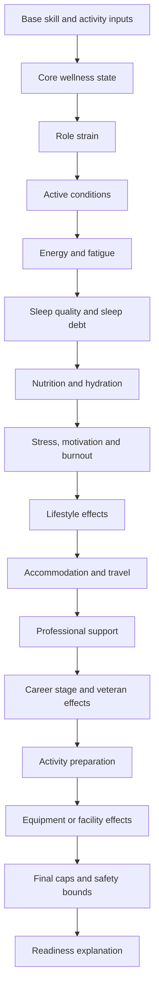

# Wellness Consolidation, Balance and Operations Hardening

## Audit summary

The Wellness codebase already had strong feature-specific modules, but the audit found repeated local balance constants and readiness-style calculations across core wellness, accommodation/travel recovery, food, lifestyle, professionals, time away, career longevity, gig preparation and UI previews. The main risks were duplicate modifier application, slightly different stat labels/ranges, client panels explaining forecasts without a canonical explanation object, and future systems being able to add another direct formula instead of using one integration surface.

Key findings:

- `wellnessSystem.ts` owned core 0-100 vitals and performance modifiers, while recovery, food and gig-preparation modules had their own local caps.
- Nutrition, accommodation, travel and professional support already capped their own effects, but no global cap prevented combined bonuses from exceeding intended MMO-wide limits.
- Role readiness was described in docs and gig preparation, but not available as a reusable role-specific server-compatible API.
- Existing idempotency patterns existed for activity logs, travel recovery events and social/gig contribution systems; Wellness needed stable modifier ids and stacking groups to extend that protection into calculation composition.
- The Wellness UI was feature-rich and needed a higher-level explainable readiness summary before advanced panels.
- Admin tooling had balance/admin frameworks, but Wellness needed at least a read-only operational inspection surface before any live editor.
- NPC requirements can use the same conceptual pipeline with deterministic aggregate simulations instead of hidden perfect wellness.

## Canonical Wellness engine

`src/lib/wellnessSystem.ts` now exposes the canonical Wellness calculation surface:

1. `WELLNESS_CANONICAL_BALANCE` stores versioned caps, readiness thresholds, role restrictions and rollback metadata.
2. `WELLNESS_PIPELINE_ORDER` defines the shared modifier processing order.
3. `normalizeWellnessModifiers` deduplicates stable ids, resolves non-stacking groups and caps raw modifier values.
4. `calculateCanonicalReadiness` produces role readiness, risk, a bounded performance modifier and an explanation object.
5. `buildCoreWellnessModifiers` converts core vitals into canonical modifier entries so future systems do not duplicate energy/fatigue/sleep/burnout formulas.

Future systems should request readiness or submit modifiers through this engine. They should not calculate direct Wellness performance effects in UI components or feature-specific services.

## Modifier pipeline



Every modifier carries source, category, target, raw value, capped value, stacking group, priority, duration, additive/multiplicative mode, stackability, player-facing explanation and diagnostic id.

## Readiness model

Supported roles are gig, vocal, instrumental, rehearsal, practice, recording, songwriting, touring, travel, professional service, mentoring, return from break and comeback. States are fully ready, ready, minor concerns, reduced readiness, high risk, restricted and unavailable. Restrictions are role-specific: a voice restriction can block vocal performance while still allowing songwriting.

## Explanation object example

```json
{
  "finalResult": 74,
  "baseValue": 71,
  "positiveContributors": ["good energy increased readiness", "quality sleep improved readiness"],
  "negativeContributors": ["high fatigue reduced readiness"],
  "cappedContributors": [],
  "appliedRestriction": null,
  "suggestedAction": "Add rest, food, hydration or lighter preparation before committing.",
  "confidence": "actual"
}
```

## Final balance caps

- Ordinary positive combined modifier cap: +12%.
- Ordinary negative combined modifier cap: -25%.
- Severe negative cap is reserved for explicit direct restrictions: -40%.
- Readiness-derived performance modifiers clamp to the global cap range.
- Feature-specific caps remain allowed only when they are stricter than the global cap.

## NPC processing model

NPCs should use the same modifier categories and readiness thresholds but may be processed through aggregate daily batches. The deterministic simulation utility includes `npc_artist` and long-tour scenarios to verify NPCs do not receive hidden perfect recovery and do not collapse from lack of micromanagement.

## Admin operations

The admin dashboard now includes a read-only Wellness operations card showing the active balance profile, global caps and deterministic simulation smoke output. This deliberately avoids arbitrary stat editing. Future corrective actions should be explicit commands that record actor, reason, before/after values and idempotency keys.

## Simulation and balance tests

`src/lib/wellnessSimulation.ts` provides deterministic scenarios for new players, tours, veterans, strained performers, burnout, premium/basic recovery, retirement returns, NPCs and inactive characters. Unit tests assert core fairness assumptions with tolerance-style expectations rather than brittle exact values.

## Privacy, permissions and anti-abuse

Private data remains condition details, strain, therapy, burnout severity, alcohol exposure, sleep debt, nutrition detail, care plans, treatment history, career-wear detail and forecasts. Public surfaces should use broad readiness/status language unless consent or operational need exists. Anti-abuse protection should use stable modifier ids, stacking groups, activity/recovery idempotency keys and server-side recalculation at authoritative writes.

## Data retention and repair guidance

Use detailed recent events, daily aggregates for medium-term history, monthly aggregates for career analysis and permanent milestone records for major conditions, retirement/comeback and admin corrections. Repair commands must support dry-run, bounded batches, audit rows and safe retries.

## Performance and observability

Recommended metrics: processing duration, characters/NPCs processed, job failures/retries, duplicate-prevention triggers, invalid corrections, condition incidence/recovery, burnout incidence, restriction rate, forecast requests, appointment completions, repair actions, API latency and cache hit rate. Alert hooks should integrate with existing cron/monitoring surfaces rather than adding a new platform.

## Developer integration guide

1. Request readiness with `calculateCanonicalReadiness`.
2. Submit activity effects as canonical modifiers plus existing idempotent activity logs.
3. Add modifiers with stable `id`, `stackingGroup` and `diagnosticId`.
4. Add new conditions as restrictions/modifiers, not direct UI penalties.
5. Add recovery sources as capped modifiers.
6. Gate progression by canonical readiness/state and server-side checks.
7. Expose the returned explanation object to players with expandable detail.
8. Write processing with idempotency keys and safe retries.
9. Avoid duplicate modifiers by reusing stacking groups.
10. Add analytics and simulation/balance tests for new modifier categories.

## Known limitations and future maintenance

This consolidation creates the canonical engine and admin/readiness/simulation surfaces without replacing every historical feature module in one risky patch. Follow-up work should migrate feature-specific performance calls to `calculateCanonicalReadiness`, add database-backed audit/repair RPCs for production, and attach screenshots from a provisioned browser environment.
